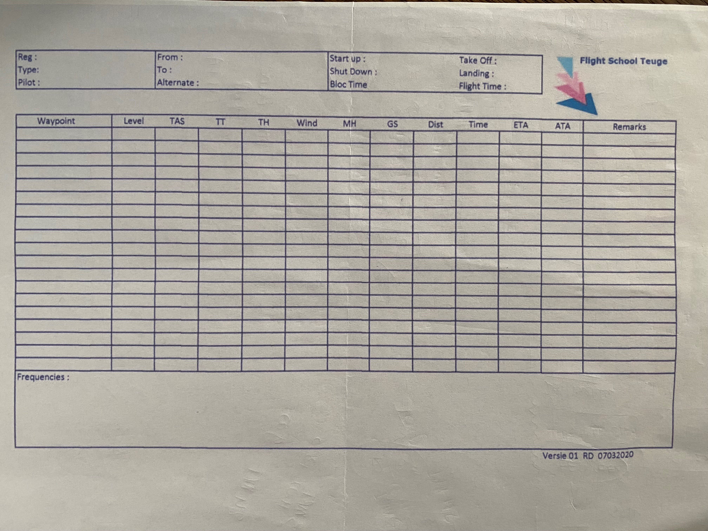

# NavigationPlan

A WPF .NET 8 desktop application for VFR flight navigation planning, built for student pilots at **Flight School Teuge** (EHTE), the Netherlands.



## Features

- **Interactive map** — OpenStreetMap tiles via Mapsui. Click anywhere to add waypoints, right-click a pin to remove it. Start point is always EHTE Teuge.
- **Auto-calculation** — enter wind direction/speed and TAS; the app computes True Track, Wind Correction Angle, True Heading, Magnetic Heading, Ground Speed, Distance, Time, and ETA for every leg.
- **Dark mode** — full dark theme throughout.
- **Navigation plan table** — matches the Flight School Teuge paper form (NavPlan.jpg). ATA and Remarks columns are editable in-flight.
- **Save / Open** — save the completed plan as a `.txt` file and reopen it later to restore all fields and waypoints on the map.
- **Print** — sends an A4 landscape print to any printer or PDF driver.

## Nav Plan Columns

| Column | Description |
|--------|-------------|
| Waypoint | Name of the fix |
| Level | Cruise altitude (ft) |
| TAS | True Air Speed (kt) |
| TT | True Track (°) |
| TH | True Heading (°) |
| WCA | Wind Correction Angle (°) |
| MH | Magnetic Heading (°) |
| GS | Ground Speed (kt) |
| Dist | Distance (NM) |
| Time | Leg time (min, rounded) |
| ETA | Estimated Time of Arrival |
| ATA | Actual Time of Arrival (fill in-flight) |
| Remarks | Free text |

## Getting Started

### Prerequisites
- [.NET 8 SDK](https://dotnet.microsoft.com/download/dotnet/8.0)
- Windows 10 or later (WPF)

### Run
```bash
git clone https://github.com/ronaldgithub/NavigationPlan.git
cd NavigationPlan/NavigationPlan
dotnet run
```

Or open `NavigationPlan.slnx` in Visual Studio 2022+.

## Usage

1. **Add waypoints** — click on the map. EHTE Teuge is pre-placed as the fixed departure point.
2. **Fill in the left panel** — aircraft details, wind direction/speed, QNH, TAS, cruise level, magnetic variation.
3. **Click Calculate** — all nav plan values are computed automatically.
4. **Save** — exports the plan to a `.txt` file (also usable with Open… to restore a session).
5. **Print** — sends an A4 landscape form to your printer or PDF driver.

## Tech Stack

- **WPF .NET 8**
- **[Mapsui.Wpf 4.1.9](https://mapsui.com)** — map control with OpenStreetMap tiles
- **[CommunityToolkit.Mvvm 8.4.0](https://learn.microsoft.com/en-us/dotnet/communitytoolkit/mvvm/)** — MVVM pattern

## License

MIT
